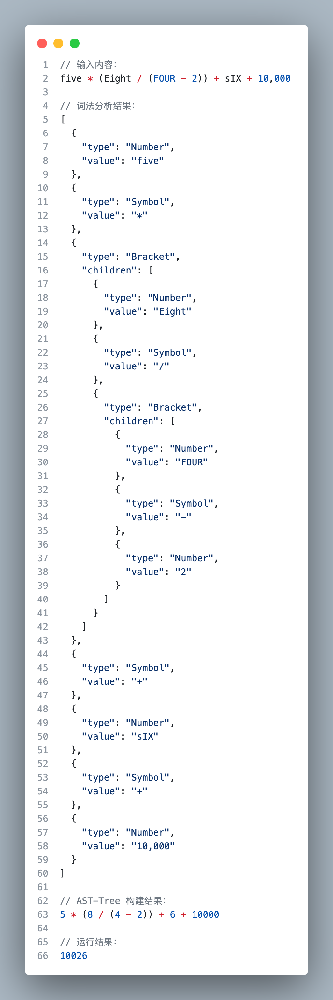
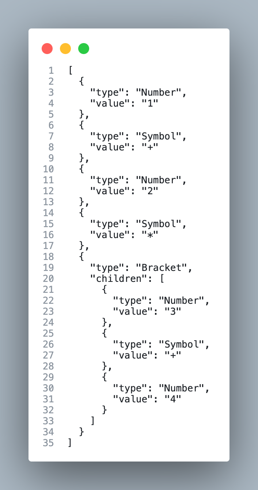

# 极其通俗易懂的 AST-Tree 原理
> 关于 `AST-tree` 是什么这里不做介绍，如果你对这个仓库感兴趣说明你已经大概了解了什么是 `AST-tree`

## 我们的目标
我们将 JavaScript 编写一个数字运算的程序，仅支持 +、-、* 和 \。
直接看结果：
```js
run('five * (Eight / (FOUR - 2)) + sIX + 10,000', [wordBuilder, thousandBuilder]);
```
浏览器控制台：


## 实现
因为数字计算有多个小括号嵌套的情况，进行词法分析时我们是从左到右分析，我们需要为了给当前的数字找到属于它所存在的小括号。

比如：`1 + (2 * (4 - 2) / (8 / (2 + 2))) `。我们把他们依次放到队列集合中。
- step1：我们找到了 `1`，把它放入队列集合
- step2：我们找到了 `+`，把它放入队列集合
- step2：我们找到了 `(`，我们临时创建一个 `Arr1`, 用来存放小括号内的数字。
  - step2-1：我们找到了 `2`，把它放入 `Arr1`
  - step2-2：我们找到了 `*`，把它放入 `Arr1`
  - step2-3：我们又找到一个`(`，我们又必须临时创建一个 `Arr2`, 用来存放小括号内的数字。
    - step2-3-1：我们找到了`4`，把它放入 `Arr2`
    - step2-3-2：我们找到了`-`，把它放入 `Arr2`
    - step2-3-3：我们又找到一个`2`，把它放入 `Arr2`
    - step2-3-4：我们又找到一个`)`，这个小括号结束了，所以我们需要把 `Arr2` 放入到 `Arr1`，
  - step2-4：我们又继续重复上面的规则继续寻找...

我们发现了什么规律？在处理小括号时，我们最新创建的小括号最先结束，一开始创建的小括号最后结束。所以这符合 `先进先出` 的原则，所以我们使用一个栈结构的数据。

### 栈的实现
```js
class Stack {
  constructor() {
    this._stack = [];
    this._index = -1;
  }
  // 获取栈内当前的对象，如果没有则返回空
  get current() {
    if (this._index === -1) {
      return null;
    }

    return this._stack[this._index];
  }
  // 进栈
  push(item) {
    return (this._stack[++this._index] = item);
  }
  // 出栈
  pop() {
    return this._stack[this._index--];
  }
}
```

测试结果：
```js
const stack = new Stack();
stack.push({ val: 1 });
stack.push({ val: 2 });
console.log(stack.current.val === 2); // true
stack.pop();
console.log(stack.current.val === 1); // true
```

### 词法分析
我们已经实现了栈结构，现在来实现词法分析器。
我们的词法对象（token）一共有 3 中类型：
- 数字：`1、2、...8、9`
```js
{
  "type": "Number",
  "value": "1",
}
```
- 运算符：`+、-、*、/`
```js
{
  "type": "Symbol",
  "value": "+",
}
```
- 小括号：`(、)`
```js
{
  "type": "Bracket",
  "children": [], // 没有 value，children 用来存放括号内的其他词法节点(token)
}
```

词法分析器：
```js
/**
   * 词法分析器
   * @str {string} str 需要分析的字符串
   * @return {Array} 返回一个对象数组
   * 1. 先将字符串按照空格分割成数组
   * 2. 遍历数组，将字符串按照规则转换成对象
   * 3. 返回对象数组
   *
   * 规则：
   * 1. 数字：类型为 Number
   * 2. 运算符：类型为 Symbol
   * 3. 括号：类型为 Bracket
   */
function tokens(str) {
  const strList = str
    // +、-、*、/、(、) 前面不是空格时，增加空格，比如：1*2 => 1 *2
    .replace(/(?<=\S)([+\-\*\/\(\)])/g, " $1")
    // +、-、*、/、(、) 后面不是空格时，增加空格，比如：1*2 => 1* 2
    .replace(/([+\-\*\/\(\)])(?=\S)/g, "$1 ")
    // 多个连续的空格替换成1个空格，比如：'      ' => ' '
    .replace(/\s+/g, " ")
    .split(" ");
  // 用于存储词法对象（token）的数组
  const tokenList = [];
  // 栈 - 用来处理小括号
  const stack = new Stack();
  // 循环 strList
  // 比如输入为：'1 + 2 * (3 + 4)'
  // strList 为：['1', '+', '2', '*', '(' , '3', '+', '4', ')']
  for (const item of strList) {
    if (item === "(") {
      // 遇见起始小括号，创建一个 Bracket 对象，进行入栈操作,
      stack.push({
        type: "Bracket",
        children: [],
      });
    } else if (item === ")") {
      // 遇到结束小括号，进行出栈操作
      const result = stack.pop();
      // 如果是空栈，说明没有起始小括号，则直接将结果推入 tokenList
      // 否则，将结果推入当前的小括号。这是为了处理小括号嵌套的情况
      const target =  stack.current === null
        ? tokenList
        : stack.current.children;
      target.push(result);
    } else {
      // 如果是 数字 或者 运算符的情况
      // 判断当前如果是空栈，则直接将内容结果推入 tokenList
      // 否则，将内容推入当前小括号对象的 children 数组中
      const target = stack.current === null
        ? tokenList
        : stack.current.children;
      target.push({
        type: ["+", "-", "*", "/"].includes(item) ? "Symbol" : "Number",
        value: item,
      });
    }
  }
  return tokenList;
}
```
测试结果：
```js
tokens("1 + 2 * (3 + 4)") 
```


### 生产可执行代码
我们现在拿到了 AST-tree，接下来就是将 AST-tree 转换成可执行代码。

```js
function build(tokens) {
  let str = "";
  for (const token of tokens) {
    if (token.type === "Bracket") {
      // 如果是小括号，就递归 token.children
      str += `(${build(token.children)})`;
    } else {
      str += token.value;
    }
  }
  return str.replace(/\s$/, "");
}
```
测试：
```js
const tokenList = tokens("1 + 2 * (3 + 4)");
console.log(build(tokenList)); // 1+2*(3+4)
```
执行的结果为：`1+2*(3+4)`, 我们编译成功了。但是编译完的结果没有空格，挤在一起不方便查看。为了方便查看我们加上空格。

> 其实并不止是为了方便查看，而是后面引出其他的内容

修改后的编译器代码：
```diff
function build(tokens) {
  // 默认的构建钩子，将 token 内容拼接成字符串，并添加尾部空格，为了是更方便查看 build 的结果
+ const defaultHook = (t) => `${t.value} `;
  let str = "";
  for (const token of tokens) {
    if (token.type === "Bracket") {
      // 如果是小括号，就递归 token.children
+     str += `(${build(token.children)}) `;
-     str += `(${build(token.children)})`;
    } else {
+     str += defaultHook(token);
-     str += token.value;
    }
  }
  return str.replace(/\s$/, "");
}
```
测试结果：
```js
const tokenList = tokens("1 + 2 * (3 + 4)");
console.log(build(tokenList)); // 1 +2 * (3 + 4)
```
构建内容加上了空格分割：`1 + 2 * (3 + 4)`

### 编译器扩展
我们输入 `1 + 2 * (3 + 4)` 然后 build 结束导出 `1 + 2 * (3 + 4)` 也太没意思了。接下来我们添加扩展功能，来体现 `AST-tree` 的威力。

#### 给 build 函数添加拓展能力
我们现在输入这么一个内容：
```js
const tokenList = tokens("Five * (Eight / (Four - TWO)) + Six");
console.log(build(tokenList)); // Five * (Eight / (Four - TWO)) + Six
```

我们想要得到的结果是：`5 * (8 / (4 - 2)) + 6`, 但现在导出的确是：`Five * (Eight / (Four - TWO)) + Six`。

还记得咱们在 build 里面加了一个 `defaultHook` 的钩子吗？
这个 `defaultHook` 钩子的作用是为我们导出的每个 `token.value` 添加一个空格。

既然我们可以给 `token.value` 添加一个空格，那我们也可以做其他的内容修改。

我们先修改一下 `build` 函数，让其支持拓展钩子。
```diff
+ function build(tokens, buildHooks) {
- function build(tokens) {
  // 默认的构建钩子，将 token 内容拼接成字符串，并添加尾部空格，为了是更方便查看 build 的结果
  const defaultHook = (t) => `${t.value} `;
  // buildHooks {Function|Array<Function>} 用来构建单个 token 内容的钩子，Array<Function> 时，构建结果将类似管道一样，按顺序传递处理 token 的结果
+ const hooks = Array.isArray(buildHooks)
+   ? [...buildHooks, defaultHook]
+   : typeof buildHooks === "function"
+     ? [buildHooks, defaultHook]
+     : [defaultHook];
  let str = "";
  for (const token of tokens) {
    if (token.type === "Bracket") {
+     str += `(${build(token.children, buildHooks)}) `;
-     str += `(${build(token.children)}) `;
    } else {
      // 使用 reduce 串行执行构建函数
+     str += hooks.reduce((t, fn) => fn(t), token);
-     str += defaultHook(token);
    }
  }
  return str.replace(/\s$/, "");
}
```
完成代码：
```js
/**
 * 把词法树（tokens）构建成 js 能执行的代码
 * @tokens {Array} token 词法树 list
 * @buildHooks {Function|Array<Function>} 用来构建单个 token 内容的钩子，Array<Function> 时，构建结果将类似管道一样，按顺序处理 token
 * @returns {String}
 */
function build(tokens, buildHooks) {
  // 默认的构建钩子，将 token 内容拼接成字符串，并添加尾部空格，为了是更方便查看 build 的结果
  const defaultHook = (t) => `${t.value} `;
  const hooks = Array.isArray(buildHooks)
    ? [...buildHooks, defaultHook]
    : typeof buildHooks === "function"
      ? [buildHooks, defaultHook]
      : [defaultHook];
  let str = "";
  for (const token of tokens) {
    if (token.type === "Bracket") {
      str += `(${build(token.children, buildHooks)}) `;
    } else {
      str += hooks.reduce((t, fn) => fn(t), token);
    }
  }
  return str.replace(/\s$/, "");
}
```

#### 实现 英文单词 构建器
```js
const wordBuilder = (t) => {
  const numberEnum = [
    'ZERO',
    'ONE',
    'TWO',
    'THREE',
    'FOUR',
    'FIVE',
    'SIX',
    'SEVEN',
    'EIGHT',
    'NINE'
  ].reduce(
    (obj, numStr, index) => {
      obj[numStr] = `${index}`;
      return obj;
    },
    ({})
  );
  t.value = numberEnum[t.value.toUpperCase()] || t.value;
  return t;
}
```
测试：
```js
const tokenList = tokens("Five * (Eight / (Four - TWO)) + Six");
console.log(build(tokenList, wordBuilder)); // 5 * (8 / (4 - 2)) + 6
```

甚至我们可以混用（小写+大写+数字）：
```js
const tokenList = tokens("five * (Eight / (FOUR - 2)) + sIX");
console.log(build(tokenList, wordBuilder)); // 5 * (8 / (4 - 2)) + 6
```

现在我们输入`"Five * (Eight / (Four - TWO)) + Six"` 构建结果为 `5 * (8 / (4 - 2)) + 6`，我们还可以继续扩展内容。

#### 添加 数字千分位 构建器
```js
const thousandBuilder = (t) => {
  if (t.value.includes(',')) {
    t.value = t.value.replace(/,/g, '');
  }
  return t;
}
```
测试：
```js
const tokenList = tokens("five * (Eight / (FOUR - 2)) + sIX + 10,000");
console.log(
  build(tokenList, [wordBuilder, thousandBuilder])
); // 5 * (8 / (4 - 2)) + 6
```

#### 其他
其实我们还可以添加更多的拓展，甚至我们可以不把它当成数字计算器，我们只需要修改一下 `tokens` 函数，甚至可以直接创建一个简单的新编程语言。

如果你有什么想法，欢迎提交 PR。